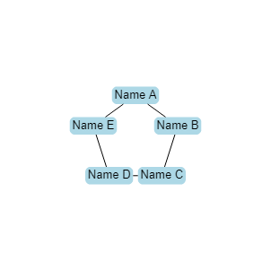

## Draw names in a circle
Given a list of names, generates a diagram that draws the given names in a circular arrangement. The idea is that if you have a group of people that want to play a game together online, and the game cares about who's sitting next to whom, you can feed their names into the program to create a virtual seating chart.

## Usage
1. If you haven't already, install [Node.js](https://nodejs.org/en/download/).
1. Download the source files
1. Navigate to the project directory
1. Run the following command: `npm start [names separated by spaces]`

For example, running `npm start "Name A" "Name B" "Name C" "Name D" "Name E"` will product the following image:

